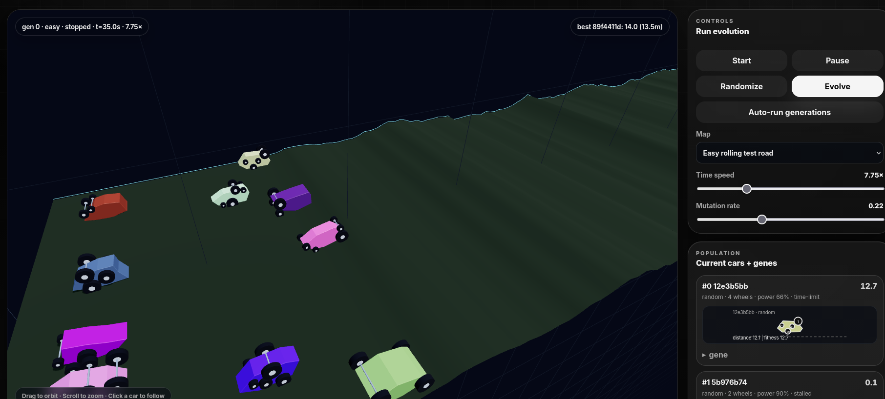
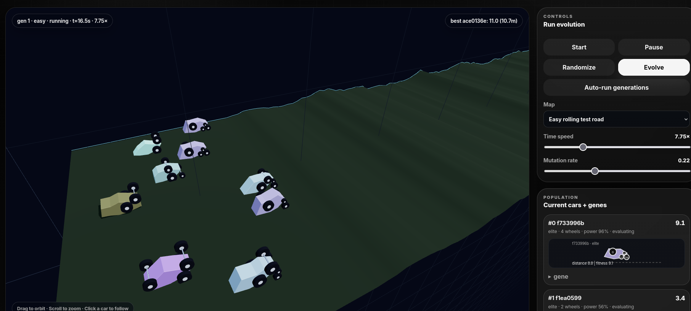
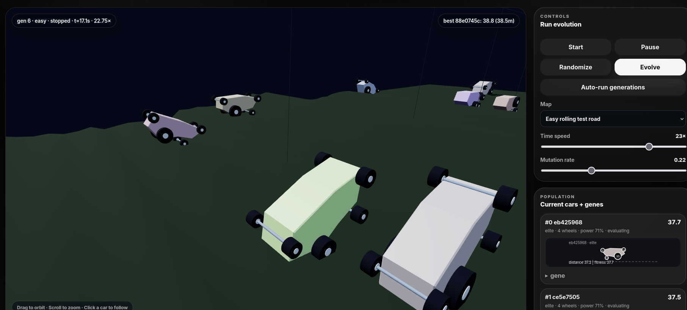
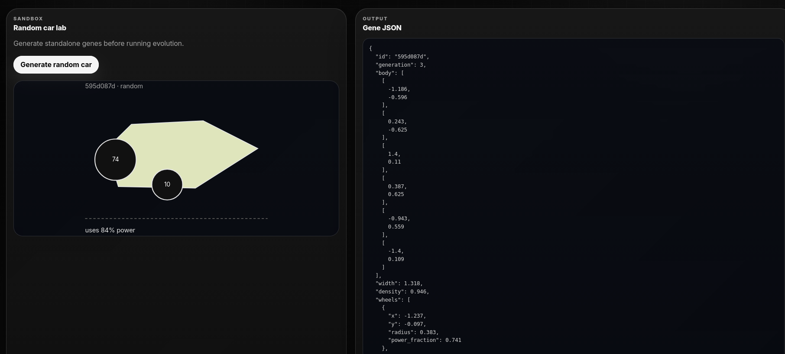
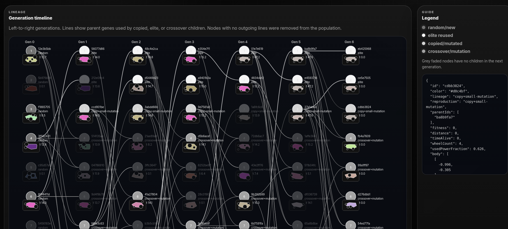

# Genetic Car Simulator

A browser-controlled simulator for evolving simple 3D cars over a fixed ragged road.

Deployed at <https://genetic-simulator.shelamanov.com/>.

- Python owns genes, random car generation, crossover/elitism/copying/mutation, road generation, and toy physics evaluation.
- The browser visualizes the simulation in 3D and shows each car's 2D body projection plus full gene JSON.
- A separate **Random car lab** tab generates standalone random car genes.
- A persistent **Leaderboard** tab stores the top 10 cars per map, with one best entry per visitor.

## Screenshots











## Run locally

```bash
./setup_venv.sh
./run_server.sh
```

## Tests

```bash
./run_tests.sh
```

## Frontend build

The checked-in static bundle is served directly. To rebuild it from TypeScript/Vite:

```bash
cd frontend
npm install
npm run typecheck
npm run build
```

Or manually:

```bash
python -m venv .venv
source .venv/bin/activate
pip install -r requirements.txt
python -m app.server
```

Open <http://localhost:18473>.

## Run with Docker

```bash
docker build -t genetic-car-simulator .
docker run --rm -p 18473:18473 -v genetic-car-leaderboard:/app/data genetic-car-simulator
```

Or with Docker Compose:

```bash
docker compose up --build
```

Open <http://localhost:18473>.

## Persistence and limits

- Leaderboard records are stored in `/app/data/leaderboard.json` by default. On Coolify, add persistent storage for `/app/data` so records survive redeploys/restarts.
- Override with `LEADERBOARD_FILE=/path/to/leaderboard.json` if needed.
- Idle sessions expire after 24 hours by default: `SESSION_TTL_SECONDS=86400`.
- Concurrent running simulations default to about 60% of CPU cores. Override with `SIM_MAX_RUNNING=4`.

## Controls

- **Start evaluation** resets and evaluates the current generation.
- Cars are marked done when they stop making progress for a few simulated seconds, crash, finish, or hit the time limit.
- **Time speed** slider runs more/fewer physics substeps per wall-clock frame (up to 30x from the UI; backend supports up to 40x).
- **Re-generate from performance** creates the next generation using elites, one copied/mutated survivor, tournament-selected crossover, and mutation.
- **Randomize generation** starts over with 10 fresh random genes.
- **Map** selects between easy, mixed, and brutal road presets. Easy is now the default.
- Wheels can spawn anywhere around the side profile — inside, top, sides, or bottom — while still being repaired to avoid wheel-wheel intersections.
- Color is a visual-only gene now: it crosses over and mutates for family/lineage tracking, but has no physics or fitness effect.
- **Genealogy** tab shows the left-to-right reproduction tree: elite reuse, copies, crossover/mutation, and removed genes with no descendants.
- Click cars, genealogy nodes, or leaderboard entries to inspect their data, preview/export JSON, or import a copy into a chosen population slot.
- Your leaderboard entries are highlighted and marked “you”; click your nickname to rename it.
- 3D camera: `WASD` free-fly, `Q/E` down/up, hold `Shift` for faster movement, click-drag to orbit around the road center near your view, mouse wheel to center/dolly toward what is under the cursor, click a car to smoothly follow it, drag while a car is selected to orbit around that car, and press `Esc` to return to automatic overview.
